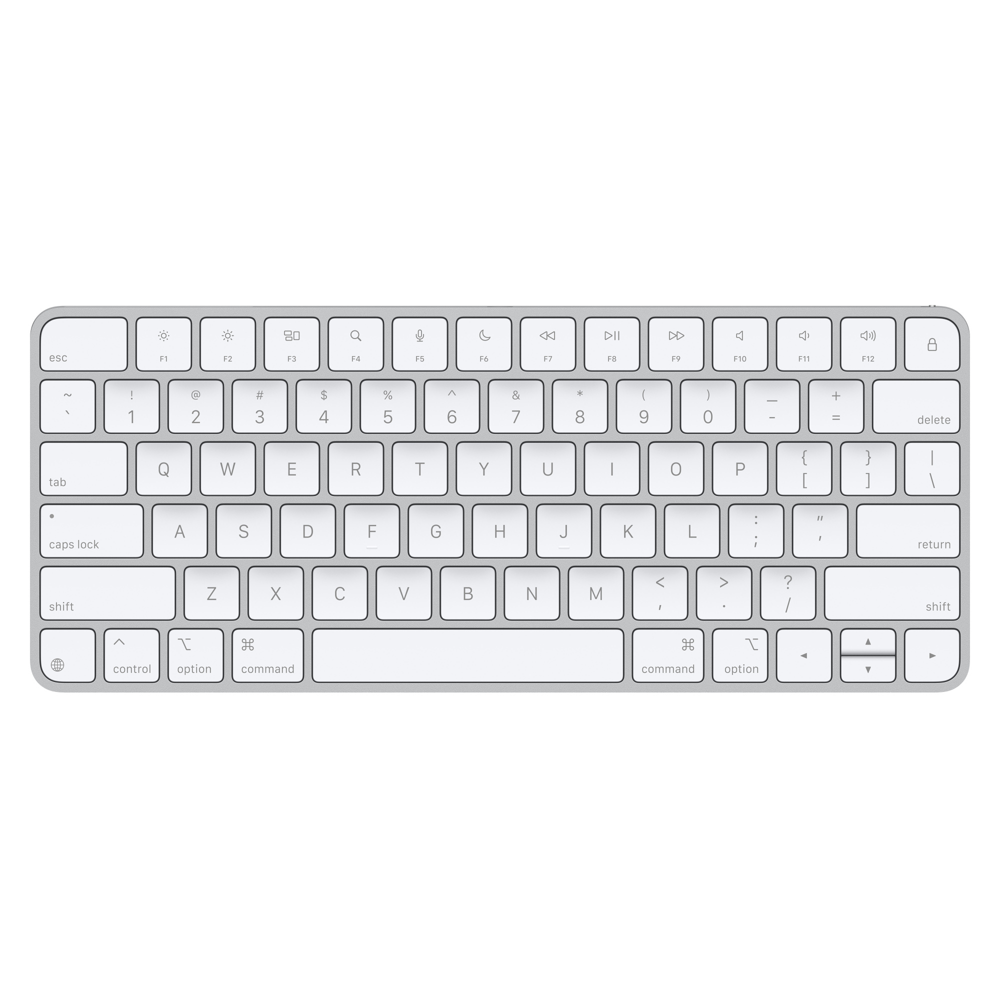
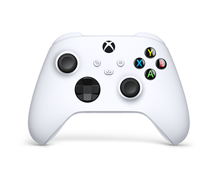
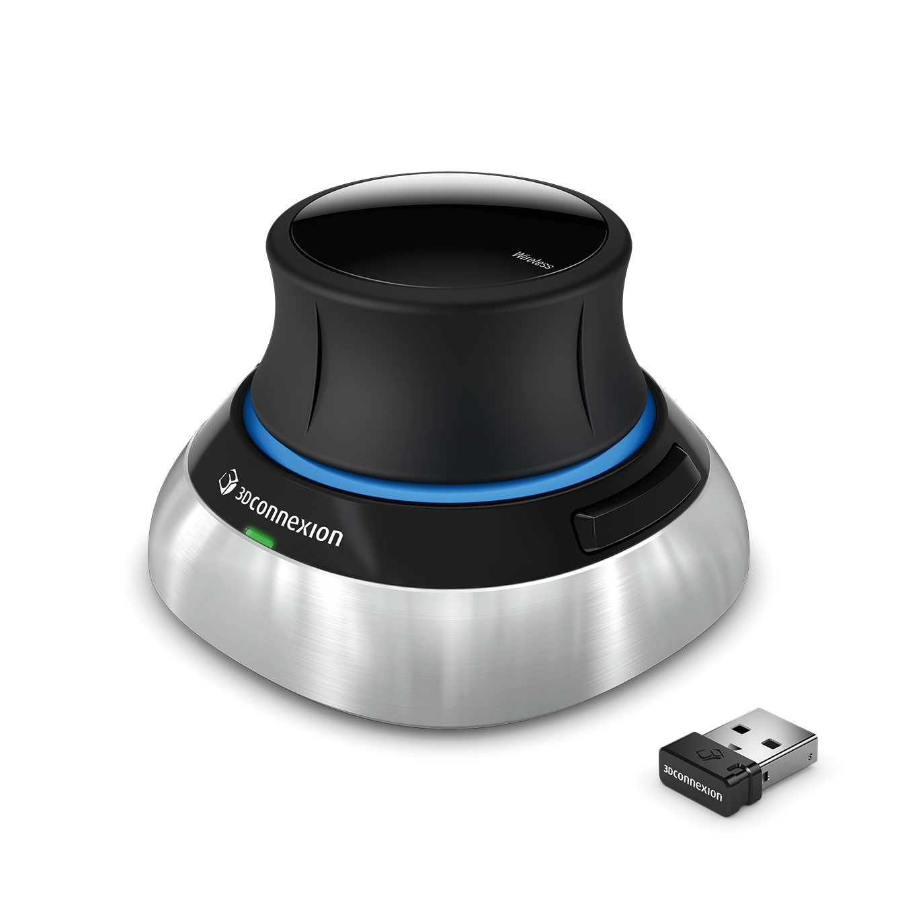

# <p align="center"> Dexhand Teleop </p>
<p align="center" float="left">
  
  
  
  
  
</p>

## Overview

A versatile teleoperation system for dexterous robotic hands, supporting multiple input devices including Apple Vision Pro, SpaceMouse, keyboard, and joystick. The system enables precise control of an Allegro Hand in both armless (floating) configuration and mounted on an xArm6 robotic arm.

## Supported Teleoperation Devices
* **Apple Vision Pro** - High-end hand tracking
* **Keyboard** - Accessible control option
* **Space Mouse** - 3D control for precision manipulation
* **Joystick** - Alternative controller option
* **Meta Quest** (Work in Progress)

## Installation

Tested on Ubuntu 20.04, CUDA 11.7 and 12.1

```bash
# Clone the repository
git clone https://github.com/DavidLXu/Dexhand_VisionPro_Teleop.git
cd Dexhand_VisionPro_Teleop

# Create and activate conda environment
conda create -n dexgrasp python=3.8
conda activate dexgrasp

# Install IsaacGym
cd path_to_isaacgym/python
pip install -e .

# Install this repository
cd DexTeleop
bash install.sh

# Install dependencies for joystick and space mouse
pip install pygame pyspacemouse
```

### Vision Pro Setup
On Apple Vision Pro, install Tracking Streamer from the App Store. Launch the application and obtain the IP address, then update the `vision_pro_ip` parameter in `dexhand_teleop.yaml` with this address.

## Usage

### Configuration
To use different teleoperation devices, modify the `teleop_device` parameter in `dexhand_teleop.yaml`:

```yaml
env:
  teleop_device: "vision_pro"  # Options: "vision_pro", "keyboard", "spacemouse", "joystick"
  vision_pro_ip: "192.168.100.17"  # IP address of Vision Pro (only needed for Vision Pro mode)
```

### Running Teleoperation

Navigate to the dexgrasp directory:
```bash
cd DexTeleop/dexgrasp
```

Run the teleoperation using:
```bash
# For convenience, use the run script
./run_teleop.sh

# Or run manually:
# For armless (floating) Allegro Hand
python run_online.py --task DexhandTeleop --algo ppo --config teleop_policy.yaml

# For Allegro Hand mounted on xArm6
python run_online.py --task DexhandTeleop --algo ppo --config teleop_policy.yaml --use_xarm6
```

Note: While we do not perform reinforcement learning, we leverage [UniGraspTransformer](https://github.com/microsoft/UniGraspTransformer)'s RL environment codebase to enable potential future extensions.

### Recording and Replaying Trajectories

The system supports recording and replaying teleoperation trajectories:

#### Recording
1. During teleoperation, press `1` to start recording
2. Perform your desired manipulation sequence
3. Press `2` to stop recording and save the trajectory
4. Trajectories are saved in the `recorded_trajectories` directory with timestamp-based filenames

#### Replaying
There are two types of replaying. The first type only replays the trajectory without dynamics.
```bash
# For convenience, use the replay script
./run_replay.sh [path/to/trajectory.json]

# Or run manually:
python tasks/replay_trajectory.py --trajectory [path/to/trajectory.json]
```

The second type of replaying considers dynamics while replaying. In `dexhand_teleop.yaml`, set `replay_mode: True`. Then the recorded trajectory is played in teleoperation environment.
```bash
./run_teleop.sh
```


## Technical Pipeline

1. **Hand Tracking**: Apple Vision Pro [Tracking Streamer](https://github.com/Improbable-AI/VisionProTeleop) provides hand keypoints
2. **Retargeting**: PyBullet [IK-based retargeting](https://github.com/leap-hand/Bidex_VisionPro_Teleop) solves joint values for Allegro URDF
3. **Simulation Control**: Isaac Gym RL Environment (this repo) handles armless force control or xarm control

## Technical Details

### 1. Armless Hand Force Control

If we use the original Allegro URDF, finger movements will cause rotation of the floating palm due to conservation of angular momentum.

<p align="center" float="left">
  
  
</p>
<p align="center">
  <em>Left: original palm inertia. Right: increased palm inertia.</em>
</p>

We used a trick to increase the palm's inertia, which makes the floating hand control more stable.

### 2. xArm Configurations

For the allegro hand mounted on xArm6, there are multiple configurations for each end-effector pose.

<p align="center" float="left">
  
  
</p>
<p align="center">
  <em>Left: "stretched" arm configuration. Right: "twisted" arm configuration.</em>
</p>

For instance we typically want the first configuration which is more "stretched" as the GIF shows, but it's possible to get the second configuration which is more "twisted" where the pitch rotation is constrained. To solve this, we can use a 7DoF arm (franka) with more advanced trajectory planning algorithms, which is beyond the scope of this repo.

### 3. Contact-rich Interaction

Interaction with various objects. In `dexhand_teleop.yaml`, set `use_object` as `True`. You can use your own object, and modify `object_asset_path` and `object_asset_file`.

<p align="center" float="left">
  
</p>

## Teleoperation Device Controls

### Keyboard Controls
In the gym viewer init viewer perspective, +x is pointing left, +y is pointing at us, +z is pointing up.

```
q[-z] w[-y] e[+z]                  u[+qy] i[+qx] o[-qy]
a[+x] s[+y] d[-x] f[grsp]   h[rls] j[+qz] k[-qx] l[-qz]
```

- `q w e a s d` controls translation
- `u i o j k l` controls rotation
- `f` to grasp and `h` to release fingers heuristically

Note: May encounter gimbal lock. Refer to class `KeyboardTeleopDevice` for implementation details.

### Joystick Controls

| Control | Action |
|---------|--------|
| Left stick | XY translation |
| X button | -Z translation |
| Y button | +Z translation |
| Right stick | Roll and pitch rotation |
| Shoulder triggers | Yaw rotation |
| A button | Grasp |
| B button | Release |

Note: May encounter gimbal lock. Refer to class `JoystickTeleopDevice` for implementation details.

### Space Mouse Controls

| Control | Action |
|---------|--------|
| Mouse Cap| Delta 6D pose |
| Left button | Grasp |
| Right button | Release |

Note: May encounter gimbal lock. Refer to class `SpaceMouseTeleop` for implementation details.
Install all the dependencies and set the permission.
```bash
sudo apt-get install libhidapi-dev
```
Change to super user.
```bash
sudo su
```
run:
```bash
echo 'KERNEL=="hidraw*", SUBSYSTEM=="hidraw", MODE="0664", GROUP="plugdev"' > /etc/udev/rules.d/99-hidraw-permissions.rules
```
exit, and return to your user account.
```bash
exit
sudo usermod -aG plugdev $USER
newgrp plugdev
```
Then, restart your computer to load all the changes.
Or you can see this [page](https://github.com/JakubAndrysek/PySpaceMouse) and install all the dependencies.

## Development Roadmap

- [x] Bridging Apple Vision Pro Tracking Streamer and PyBullet IK solver
- [x] Support for URDF: Armless (floating) Allegro hand
- [x] Support for URDF: Allegro hand mounted on xArm
- [ ] Support for URDF: Franka Arm and LEAP Hand
- [ ] Support for Bi-hands and Bi-arms
- [x] Support for INPUT source: Joystick
- [x] Support for INPUT source: 3D Mouse
- [x] Support for INPUT source: Keyboard
- [ ] Support for INPUT source: Meta Quest
- [x] Support for trajectory recording and replay
