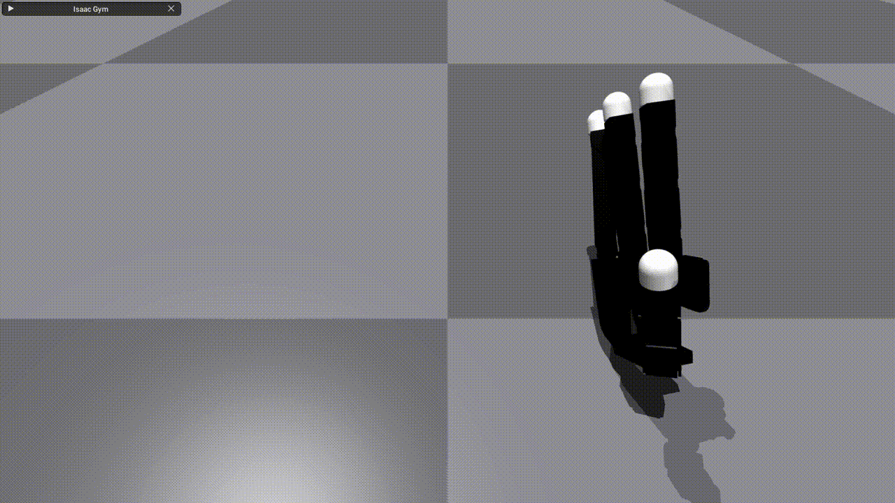
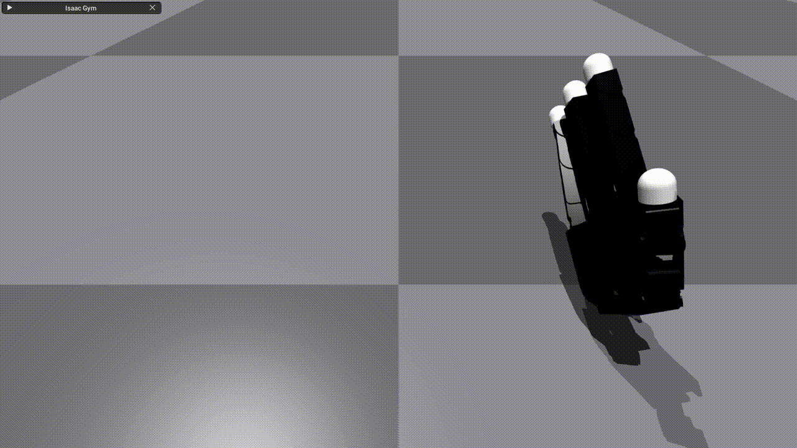

# Installation
```
git clone https://github.com/DavidLXu/Dexhand_VisionPro_Teleop.git
conda create -n dexgrasp python=3.8
conda activate dexgrasp
# install isaacgym
cd path_to_isaacgym/python
pip install -e .
# install this repo
cd DexTeleop
bash install.sh
```

# Usage
Change to `DexTeleop/dexgrasp` directory
```bash
cd DexTeleop/dexgrasp
```

For armless (floating) Allegro Hand
```bash
python run_online.py --task DexhandTeleop --algo ppo --config teleop_policy.yaml
```

For Allegro Hand mounted on xArm6
```bash
python run_online.py --task DexhandTeleop --algo ppo --config teleop_policy.yaml --use_xarm6
```

Note: While we do not perform reinforcement learning, we leverage [UniGraspTransformer](https://github.com/microsoft/UniGraspTransformer)'s RL environment codebase to enable potential future extensions.

# Pipeline
* Apple Vision Pro [Tracking Streamer](https://github.com/Improbable-AI/VisionProTeleop) to get the original hand keypoints
* PyBullet [IK-based retargeting](https://github.com/leap-hand/Bidex_VisionPro_Teleop) to solve joint values for Allegro URDF
* Isaac Gym RL Environment (this repo) to handle either armless force control or xarm control

# Notes
## 1. Armless Hand Force Control

If we use the original Allegro URDF, finger movements will cause rotation of the floating palm due to conservation of angular momentum.
<p align="center" float="left">
  
  
</p>
<p align="center">
  <em>Left: original palm inertia. Right: increased palm inertia.</em>
</p>
We used a trick to increase the palm's inertia, which makes the floating hand control more stable.

## 2. xArm Congfigurations
For the allegro hand mounted on xArm6, there are multiple configurations for each end-effector pose. 
<p align="center" float="left">
  
  
</p>
<p align="center">
  <em>Left: "stretched" arm configuration. Right: "twisted" arm configuration.</em>
</p>
For instance we typically want the first configuation which is more "stretched" as the GIF shows, but it's possible to get the second configuration which is more "twisted" where the pitch rotation is constrained. To solve this, we can use a 7DoF arm with more advanced trajectory planning algorithms, which is beyond the scope of this repo.

## 3. Contact rich interaction
WIP. Interaction with various objects.
<p align="center" float="left">
  
</p>

# TODO
- [x] Bridging Apple Vision Pro Tracking Streamer and PyBullet IK solver.
- [x] Support for armless (floating) Allegro hand.
- [x] Support for Allegro hand mounted on xArm.
- [ ] Support for Bi-hands and Bi-arms.
- [ ] Support for Franka Arm and LEAP Hand.
- [ ] Support for data recording.