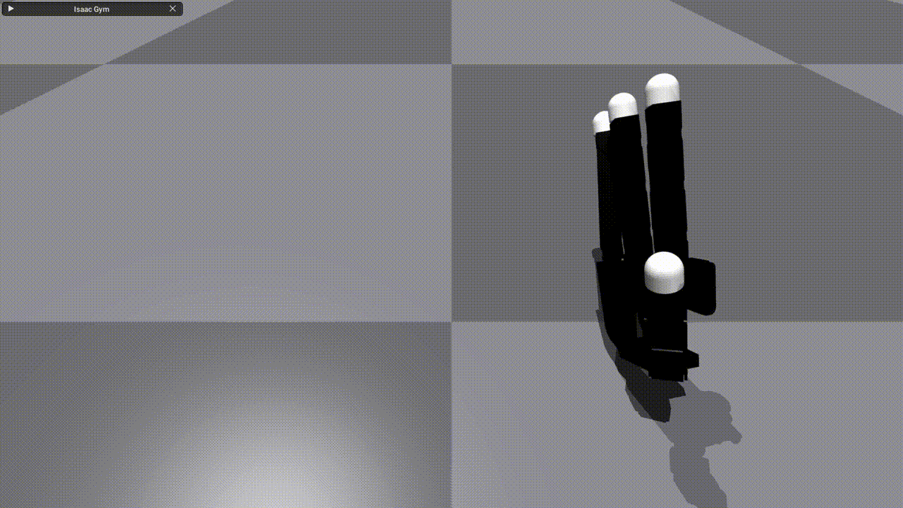
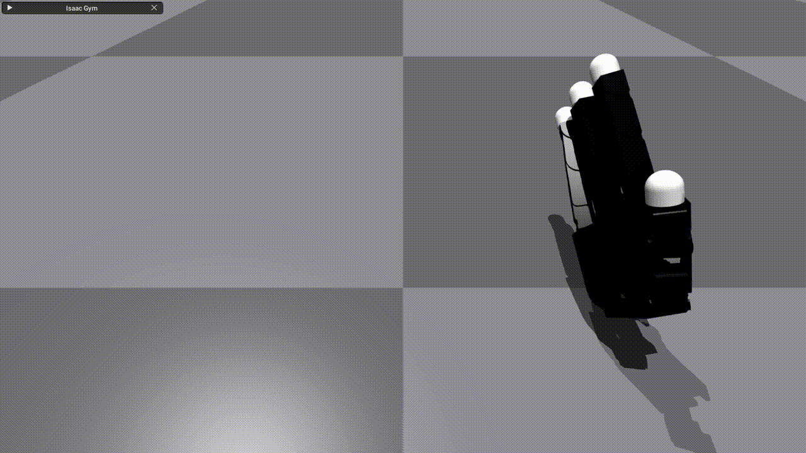

# <p align="center"> Dexhand Teleop </p>

**Note**: More teleoperation devices are included! You can use either of these as teleop devices:
* Apple Vision Pro
* Keyboard
* Space Mouse
* Joystick
* Meta Quest (WIP)

# Installation
Tested on Ubuntu 20.04, CUDA 11.7 and 12.1
``` bash
git clone https://github.com/DavidLXu/Dexhand_VisionPro_Teleop.git
conda create -n dexgrasp python=3.8
conda activate dexgrasp
# install isaacgym
cd path_to_isaacgym/python
pip install -e .
# install this repo
cd DexTeleop
bash install.sh
# for joystick and space mouse teleoperation
pip install pygame pyspacemouse 
```
On Apple Vision Pro, install Tracking Streamer from the App Store. Launch the application and obtain the IP address, then update the `vision_pro_ip` parameter in `dexhand_teleop.yaml` with this address.

# Usage
Change to `DexTeleop/dexgrasp` directory
```bash
cd DexTeleop/dexgrasp
```

For armless (floating) Allegro Hand
```bash
python run_online.py --task DexhandTeleop --algo ppo --config teleop_policy.yaml
```

For Allegro Hand mounted on xArm6
```bash
python run_online.py --task DexhandTeleop --algo ppo --config teleop_policy.yaml --use_xarm6
```

Note: While we do not perform reinforcement learning, we leverage [UniGraspTransformer](https://github.com/microsoft/UniGraspTransformer)'s RL environment codebase to enable potential future extensions.

# Pipeline
* Apple Vision Pro [Tracking Streamer](https://github.com/Improbable-AI/VisionProTeleop) to get the original hand keypoints
* PyBullet [IK-based retargeting](https://github.com/leap-hand/Bidex_VisionPro_Teleop) to solve joint values for Allegro URDF
* Isaac Gym RL Environment (this repo) to handle either armless force control or xarm control

# Notes
## 1. Armless Hand Force Control

If we use the original Allegro URDF, finger movements will cause rotation of the floating palm due to conservation of angular momentum.
<p align="center" float="left">
  
  
</p>
<p align="center">
  <em>Left: original palm inertia. Right: increased palm inertia.</em>
</p>
We used a trick to increase the palm's inertia, which makes the floating hand control more stable.

## 2. xArm Congfigurations
For the allegro hand mounted on xArm6, there are multiple configurations for each end-effector pose. 
<p align="center" float="left">
  
  
</p>
<p align="center">
  <em>Left: "stretched" arm configuration. Right: "twisted" arm configuration.</em>
</p>
For instance we typically want the first configuation which is more "stretched" as the GIF shows, but it's possible to get the second configuration which is more "twisted" where the pitch rotation is constrained. To solve this, we can use a 7DoF arm (franka) with more advanced trajectory planning algorithms, which is beyond the scope of this repo.

# Contact rich interaction
WIP. Interaction with various objects.
<p align="center" float="left">
  
</p>

# More teleoperation devices
Given the high cost of Apple Vision Pro, we have implemented alternative teleoperation methods to make the system more accessible to a wider audience.

## Keyboard
In the gym viewer init viewer perspective, +x is pointing left, +y is pointing at us, +z is pointing up.
Below shows the keymap for teleoperation.
```
q[-z] w[-y] e[+z]                  u[+qy] i[+qx] o[-qy]
a[+x] s[+y] d[-x] f[grsp]   h[rls] j[+qz] k[-qx] l[-qz]
```
`q w e a s d` controls translation

`u i o j k l` controls rotation

`f` to grasp and `h` to release fingers heuristically.

May encounter gimbal lock.

Refer to class `KeyboardTeleopDevice`.

## Joystick
To use joystick control, make sure `pygame` is installed.

| Control | Action |
|---------|--------|
| Left stick | XY translation |
| X button | -Z translation |
| Y button | +Z translation |
| Right stick | Roll and pitch rotation |
| Shoulder triggers | Yaw rotation |
| A button | Grasp |
| B button | Release |

May encounter gimbal lock.

Refer to class `JoystickTeleopDevice`.

## Space Mouse
To use Space Mouse control, make sure [PySpaceMouse](https://github.com/JakubAndrysek/PySpaceMouse) is installed.
We use a 3D Connexion Space Mouse.
| Control | Action |
|---------|--------|
| Mouse Cap| Delta 6D pose |
| Left button | grasp |
| Right button | Release |

May encounter gimbal lock.

Refer to class `SpaceMouseTeleop`.

## Meta Quest
WIP.

# TODO
- [x] Bridging Apple Vision Pro Tracking Streamer and PyBullet IK solver.
- [x] Support for URDF: Armless (floating) Allegro hand.
- [x] Support for URDF: Allegro hand mounted on xArm.
- [ ] Support for URDF: Franka Arm and LEAP Hand.
- [ ] Support for Bi-hands and Bi-arms.
- [x] Support for INPUT source: Joystick.
- [x] Support for INPUT source: 3D Mouse.
- [x] Support for INPUT source: Keyboard.
- [ ] Support for INPUT source: Meta Quest.
- [ ] Support for data recording.